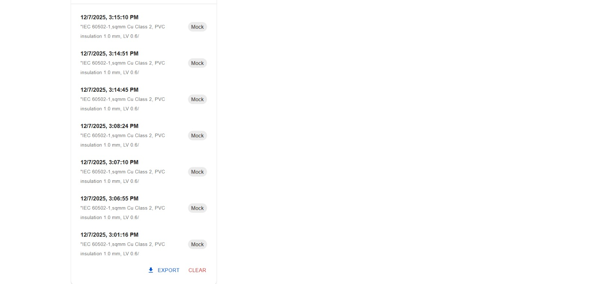
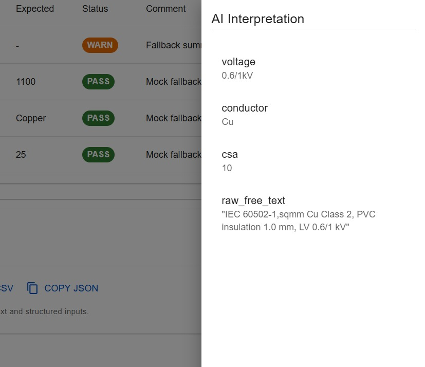

🧵 IEC Cable Design Validation System (Next.js + NestJS)
🚀 Overview

This project is an AI-powered IEC Cable Design Validation System built using a full-stack architecture:
Next.js (frontend) + NestJS (backend) + MongoDB (database).

It validates cable parameters using IEC-standard datasets, while also offering AI-based field extraction from free-text cable descriptions.

The system supports:

🧠 AI Extraction of cable specs (voltage, CSA, insulation, conductor class, etc.)

📏 Rule-Based Validation for conductor, insulation, and sheath based on IEC tables

🎨 Modern UI with Next.js 14 App Router + Material UI

🔄 Real-time validation with backend REST APIs

🗂 Modular architecture with scalable IEC rule datasets in MongoDB

The system ensures accuracy, standard compliance, and easy interpretation of cable specifications.

🛠 Tech Stack
Frontend

⚛️ Next.js 14 (App Router)

🎨 Material UI (MUI v5)

🔌 Axios (API communication)

🧩 React 18 + TypeScript

Backend

🧱 NestJS 10 (Modular Architecture)

🚀 Express Adapter

🔐 TypeScript

Database

🗄 MongoDB Atlas

🧬 Mongoose ORM

📚 Seeded IEC standard data (conductor, insulation, sheath rules)

AI Layer

🤖 Custom AI Extraction Service

📘 Parses free-text cable descriptions

🏷 Normalizes fields for validation

Validation Engine

📏 Conductor validation

🧱 Insulation validation

🎗 Sheath validation

🔄 Cross-parameter IEC logic

Other Tools

⚙ dotenv

♻ ts-node-dev

🔓 CORS enabled

✨ Key Features
🤖 AI-Powered Field Extraction
Automatically extracts:

Voltage rating

Conductor class

CSA

Insulation type

Sheath material

IEC standard reference

Displayed beautifully inside an AI Interpretation Drawer.

💻 Setup Instruction

Frontend Setup

cd frontend
npm install
npm run dev

Backend Setup

cd backend
npm install
npm run start:dev

🖼️ Application Screenshots Overview

